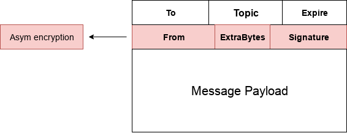

## Abstract

This SWIP defines a series of changes in Pss that simplify and reorganize the package. 

## Motivation

The current Pss API implementation requires the user to perform multiple steps (mostly crypto related)before being able to send a message. This makes the complexity of sending a message to high. Pss main function is sending messages, it should allow the user to just call one method to send a message,leaving all the payload encryption crypto to a higher layer (DApp ...) 

This SWIP aims to restructure the Pss package to expose a simpler API, that consists on a `Send` and `Receive` methods.

This simple API will allow us to get feedback, and make the needed enhancements to the API on a second version (Add Identity management, encryption methods...). This will allow us to have a real demand for every feature of the API 

## Specification
The effects of this SWIP are:

* Pss API will only expose `Send(MsgPayload, Topic, To)` and `Receive(Topic, Handler)`

* Pss Message structure changes to include an asymmetrically encrypted header
    

      
    

  
* Pss's crypto **only** functionality will be to encrypt the message header specified above. It will use the recipient identity Public key, which is no longer the same as the Node Public key, but a separate Pss Public key. The user will be able to set it
 
* Current code will be  extracted into the appropriate packages as specified in the following architecture diagram
    

      
    

    

## Rationale

The biggest user facing change introduced in this SWIP is the simplification of the API.
  
We believe this "backwards step" is necessary in order to properly define and build an API that reflects the real use cases of Pss. We may find that, after this simple API starts being used, the users don't need a built-in way to encrypt the payload, they may want to handle this on their own. We could find the opposite, in which case a future SWIP will reflect this demands.

A roadmap for extending this simple API includes, if feedback proves it necessary:
    
 * Adding a built-in way of encrypting the payload
 * Adding Identity management functionality

The Pss Message header change  allows to completely address the message without having to decrypt the whole of it (being able to decrypt this header will reveal if we are the intended recipient in a obscured send). It also allows having 'hints' (From, extraBytes) for the user to select how to decrypt the message payload.

## Backwards Compatibility

* Pss API changes (severe). All applications that use Pss will need to change api calls

## Test Cases
<!--Test cases for an implementation are mandatory for SWIPs that are affecting changes to data and message formats. Other SWIPs can choose to include links to test cases if applicable.-->
WIP
## Implementation
<!--The implementations must be completed before any SWIP is given status "Final", but it need not be completed before the SWIP is accepted. While there is merit to the approach of reaching consensus on the specification and rationale before writing code, the principle of "rough consensus and running code" is still useful when it comes to resolving many discussions of API details.-->
WIP

## Copyright
Copyright and related rights waived via [CC0](https://creativecommons.org/publicdomain/zero/1.0/).
